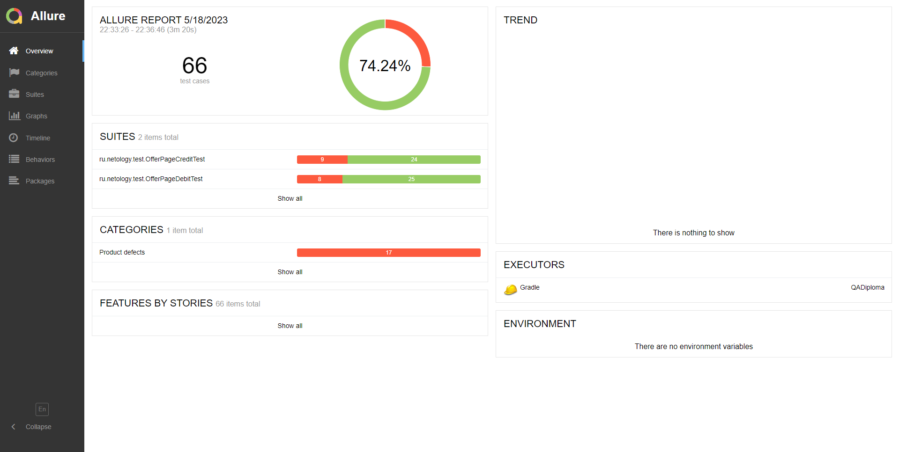

# Отчет о проведенном тестировании
## Краткое описание
**Было проведено тестирование комплексного сервиса, взаимодействующего с СУБД и API Банка.**

Приложение представляет собой веб-сервис, который предоставляет возможность купить тур по определённой цене с помощью двух способов:
1. Обычная оплата по дебетовой карте
1. Уникальная технология: выдача кредита по данным банковской карты

**На начальном этапе** было проведено **исследовательское (ручное) тестирование** для ознакомления с проектом.  
**На следующем этапе** были созданы **авто-тесты, согласно [Плана автоматизации тестирования](https://github.com/Akir800/QA_Diploma/blob/master/docs/Plan.md)**.

**Тестирование было проведено для двух баз данных - MySQL и PostgreSQL.**

**[Перечень выявленных ошибок](https://github.com/Akir800/QA_Diploma/issues).**
## Количество тест-кейсов и % успешных/не успешных
Было реализовано 66 тест-кейсов, процент успешных - 75.75% (49 тест-кейсов), процент неуспешных - 25.25% (17 тест-кейсов).

**Ниже приведен отчет из фреймворка Allure:**

## Общие рекомендации
- Разработать спецификацию, либо другим способом оформить требования для данного приложения;
- Исправить выявленные ошибки;
- Добавить "тестовые" атрибуты в приложение для повышения устойчивости авто-тестов.